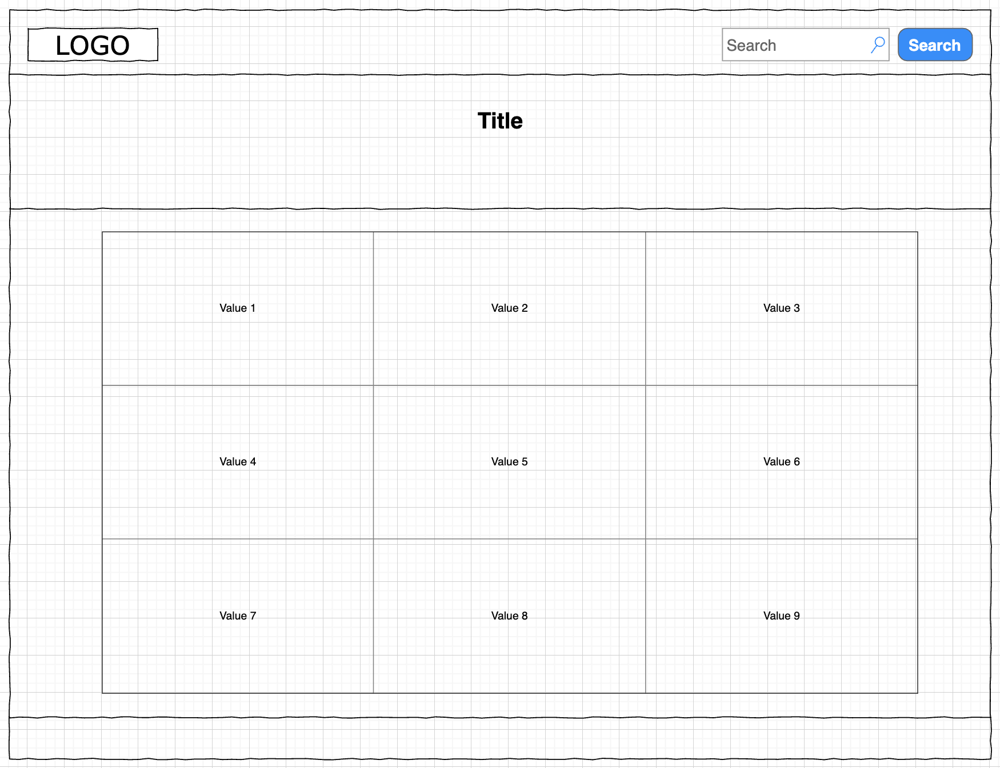
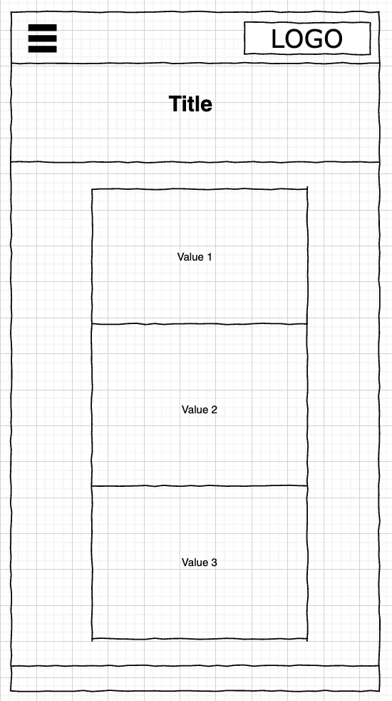

# giphy-api
## Project 2: Website with a Search Engine
____________________________________________
#### User Stories:
###### 1. “As a junior web developer, I want a simple website interface GIPHY API search as part of my portfolio and display GIF image search results based on user input.”

###### 2. “As a tech lover, I am always post GIF’s on my social media regularly, and always using GIF’s to send replies to all of my friends using chat application. I want an interface that can search GIF’s API, display images and also provide links”

____________________________________________

#### Wireframes:
##### 1. Desktop View:

##### 2. Mobile View:

____________________________________________

#### Project URL: https://santiagoelie.github.io/giphy-api

____________________________________________

#### Name: Eliezer Santiago
#### Overview/Description of Project: GIPHY API Search. The main purpose of this project is to create a website with a search engine that can loop through GIPHY's API and display image results on the page. 
#### Details:
#### Technologies used: HTML, CSS/SASS, JavaScript/jQuery
#### Ideas for future improvement:
###### 1. The Bootstrap grid system was implemented in this project as a time-saving measure. This was a first attempt at creating a web site using Bootstrap. In the future I would like to refine the responsive elements.
###### 2. In addition to improving the future styling and responsive elements on this site, I will be working on refining my JavaScript and jQuery skills for creating web apps.
###### 3. Bootstrap classes accounted for the majority of the styling on the page. I would also like to experiment more with converting Bootstrap classes to SCSS for customization.
